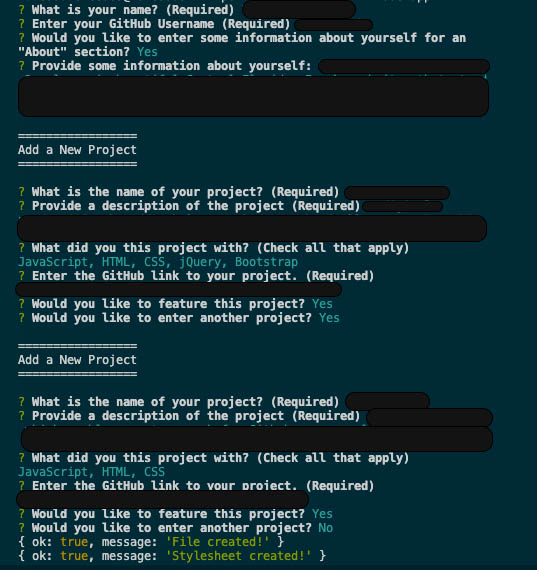

# portfolio-generator

## Description

The Portfolio Generator creates an HTML portfolio page using Node.js. It uses the command line to capture user input and place it in a JavaScript function that provides the finished HTML page as output.

## Table of Contents (Optional)

If your README is long, add a table of contents to make it easy for users to find what they need.

- [Installation](#installation)
- [Usage](#usage)
- [Credits](#credits)
- [License](#license)

## Installation

The program will run using the following tools:
-Node.js 
Visit the https://nodejs.org/en/ for download details.
-NPM
This will be included when you download Node.js
-Inquirer
Visit the NPM Package documentation for detailed instructions for adding this dependency.

Fork the repository, access the terminal, then enter "Node App" on the terminal to run the program. Answer all the question prompts. Once the file is created, access the "dist" folder found inside the repository. Open the "index.html" file on your browser. You'll see your response rendered on the browser!

## Usage

Question Prompts on the terminal:

    

    

## Credits

UCF Full Stack Bootcamp

## License

MIT License
---

